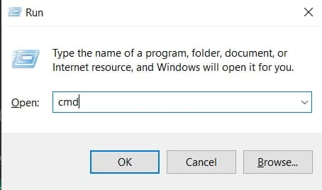
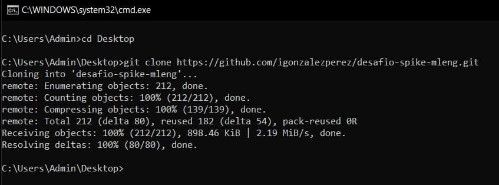
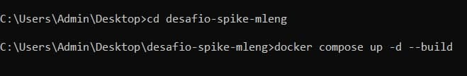

# Desafío ML Engineer - Spike - 2021/12

Este proyecto contiente el código necesario para abordar el desafío para el puesto de Machine Learning Engineer. Para ello se desarrolló una Web App en Flask para predecir el precio de la leche en base a indicadores climatológicos, macroeconómicos y precios anteriores de la misma.

## Correr la Web App
Para correr la API en un server va a ser necesario abrir la consola. En Windows esto se puede hacer con `Win + R` lo cual abrira una ventana en la que se debe escribir `cmd` y dar `Enter`.

<p align="center">
    
</p>

Esto abre la consola. Luego se deben seguir los siguientes pasos:
1. Clonar este proyecto localmente. Si se tiene `git` instalado localmente se puede clonar en la consola (en el directorio de preferencia):
    ```
    >git clone https://github.com/igonzalezperez/desafio-spike-mleng.git
    ```
    
2. En la consola, ir al directorio donde se clonó el repositorio y generar los contenedores para montar el server:
    ```
     > docker compose up -d --build
    ```
    
3. El comando anterior tomará unos segundos (~30s) en crear el contenedor, una vez terminado el proceso abrir un navegador e ir a la dirección: 
   ```
   http://localhost:5000/
   ```
### Base de datos
El repositorio contiene la base de datos a utilizar, pero esta se puede recrear (sobreescribiendo la existente) con el siguiente commando.
```

```
### Entrenamiento y optimización
Si bien los modelos y pipelines ya existen en el repositorio, estos se pueden generar (y sobreescribiran los actuales) con los siguientes comandos:
1. Optimizar parámetros vía grid search.
