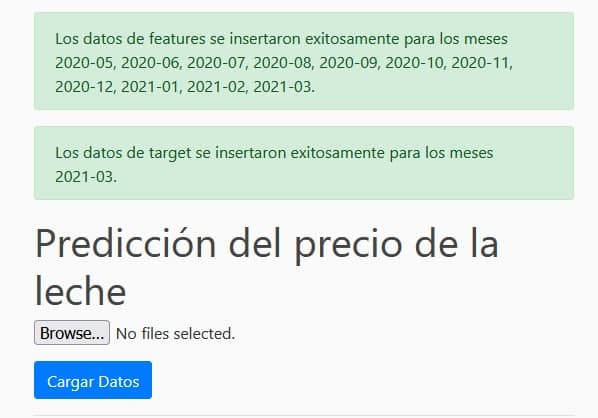

# Desafío ML Engineer - Spike - 2021/12

Este proyecto contiente el código necesario para abordar el desafío para el puesto de Machine Learning Engineer en Spike. Para ello se desarrolló una Web App en Flask para predecir el precio de la leche en base a indicadores climatológicos, macroeconómicos y precios anteriores de la leche.

# Cómo correr la Web App localmente
Primero que todo es necesario tener instalado [`docker`](https://docs.docker.com/get-docker/) y [`docker compose`](https://docs.docker.com/compose/install/). Al instalar `docker` desktop se instala ``docker compose`` automáticamente.

Para correr la API en un server va a ser necesario abrir la consola. En Windows esto se puede hacer con `Win + R` lo cual abrirá una ventana en la que se debe escribir `cmd` y dar `Enter`. En otros sistemas operativos se puede abrir de manera similar.

<p align="center">
    
</p>

Esto abre la consola. Luego se deben seguir los siguientes pasos:
## 1. Clonar repositorio
El proyecto se puede descargar directamente como un .zip y descomprimirlo localmente. Alterenativamente, si se tiene `git` instalado, se puede clonar usando la consola:

```
git clone https://github.com/igonzalezperez/desafio-spike-mleng.git
``` 

<p align="center">
    
</p>

## 2. Crear contenedor en Docker
Para correr la aplicación en un servidor local se debe ejecutar el siguiente comando en la carpeta en que esté contenido el proyecto:

```
docker compose up -d --build
```

<p align="center">
    
</p>

Al ejectuar el comando se comenzará a crear las imágenes y contenedor de docker, este proceso puede tomar algunos minutos ya que se deben instalar las librerías de python y luego se hace la optimización del modelo (grid search). Se debería ver el siguiente output:

<p align="center">
    
</p>

<p align="center">
    
</p>

<p align="center">
    
</p>

En la última imagen se ve el proceso terminado, el cual tomó `113.9s` donde la mayor parte es la de optimización. Ese proceso guarda el modelo y pipelines necesarios para luego ser consultados por la API. Finalmente se monta el server local. Cabe mencionar que la instalación de librerías y optimización solo se ejecuta al crear las imágenes, al detener y volver a usar el contenedor solo hay que esperar a que se inicialice el servidor.

También se puede checkear que el proceso finalizó correctamente en la aplicación de `Docker Desktop`, donde deberían verse los servicios activos como en la imagen siguiente:

<p align="center">
    
</p>


Es posible hacer que la app sea escalable agregando el comando `--scale app=3` donde se generan 3 instancias del servicio (se puede poner un número arbitrario, el 3 es de ejemplo), así es posible manejar el tráfico y distribuirlo en las instancias de la app. En ese caso, al ver `Docker Desktop` aparecerán todas esas instancias.

<p align="center">
    
</p>

## 3. Navegar a la App
Una vez terminado el paso anterior, abrir un navegador e ir a la dirección: 
```
http://localhost/
```
En esa dirección debería aparecer el sitio que soporta la API que se verá así:

<p align="center">
    
</p>

Probando en diferentes navegadores, en chrome puede ocurrir que localhost direccione al server (`nginx`) en vez de a la app, para solucionar esto hay que copiar la dirección exacta `http://localhost/` y no escribir solamente `localhost` en la barra de direcciones.

# Cómo usar la web app
## Predicción - Inferencia
Para generar predicciones basta con introducir el mes a predecir o bien un intervalo de meses (batch) en la caja de texto, con lo cual se ejecutará el modelo para esa(s) fecha(s) y se mostrarán los resultados en pantalla.

<p align="center">
    
</p>

<p align="center">
    
</p>

Los meses se introducen en formato `YYYY-MM` y son separados por un espacio en caso de predicción por batch.

La app muestra tanto los valores predecidos como los reales si es que estos ya existen en la base de datos (el modelo de datos se explica en la siguiente sección).

Si el input no es correcto, la app tirará un error y no se ejecutará nada. Otro caso de error ocurre cuando se busca predecir un mes para el cual no existe data suficiente para predecir, ya que para predecir el tiempo T + 1, se necesita data de T, T-1 y T-2. En cuyo caso se indicará qué meses faltan.

<p align="center">
    
</p>

## Base de datos
El contenedor genera una base de datos con los archivos que se entregaron para el desafío (`precipitaciones.csv`, `banco_central.csv` y `precio_leche.csv`) los cuales tienen data suficiente para predecir entre `2014-04` y `2020-05`. Los meses de datos existentes se pueden observar al ir a `DB INFO` en la parte superior en donde se mostrará una lista con todos los meses.

Para poder hacer más predicciones futuras es posible cargar nuevos datos, se espera que estos tengan la misma estructura que los originales de precipitación, banco central y precio. En particular se requiere que tengan todas las columnas necesarias para la predicción y que no contengan Nans.

Se revisa que los archivos tengan el formato correcto y luego se insertan las filas si es que estas no se encuentran en la BBDD. Luego, la app informa qupe columnas fueron insertadas tanto en las features (precipitación + banco central) como targets (precio de la leche).

En la carpeta `/app/data/csv/`, además de los datos originales hay otros 3 archivos con el sufijo `_dummy`, los cuales se pueden utilizar para testear la funcionalidad de carga de datos, estos datos contienen data para completar hasta el mes 2021-03, por lo que se podrá predecir hasta 2021-04 luego de insertar los datos. La data dentro de los archivos es ficticia (filas repetidas de un mes anterior) así que las predicciones no son confiables pero el punto es probar la funcionalidad.

<p align="center">
    
</p>

<p align="center">
    
</p>

Como se ve en el ejemplo, ahora se cuenta con datos para poder predecir los meses `2020-06` a `2021-04` que antes no se podía. La última predicción muestra `nan` en el precio real ya que es un valor que no existe en la BBDD.

<p align="center">
    
</p>

Adicionalmente, la base de datos se puede resetear al hacer click en la parte superior en donde aparece `Reset DB`. Esto recrea la BBDD original.

## Monitoreo
En la parte superior derecha de la app se encuentran los logs que permiten monitorear la app, estos se dividen en entrenamiento y predicción.
### Train logs
Información de grid search y entrenamiento. Se genera al crear el contenedor y no es modificado por el uso de la API. El output debería ser el siguiente:

<p align="center">
    
</p>

Se ven los parámetros de optimización así como los resultados de entrenamiento. También está la opción de descargarlo como archivo de texto.

### Pred logs
El log de predicción va guardando todas las interacciones con la app en sí. Predicciones, inputs incorrectos, data insuficiente, update de la BBDD, etc y debería verse algo como esto:

<p align="center">
    
</p>

Es importante mencionar que cuando se inserta data a la BBDD, automáticamente se vuelve a predecir con los nuevos datos para recalcular el RMSE y R2, y así poder identificar si el desempeño mejora o empeora en el tiempo, pudiendo detectar fenómenos como data drifting. Al igual que el caso anterior, es posible descargar los logs como archivos de texto.

Finalmente, un aspecto relevante a mencionar es que en realidad la única predicción que es de valor es la de un mes futuro, mientras que la app solo puede predecir hasta 2020-05, si bien esto hace que la app no sea utilizable en forma productiva, esto obedece a una falta de datos y no al diseño o arquitectura de la solución, es decir, teniendo los datos hasta el día de hoy prefectamente podría predecirse el mes siguiente.

# Planteamiento del desafío
En esta sección detallaré cómo aborde el problema a un nivel técnico, las decisiones que tomé y el porqué de ellas.
## Tech stack
- **Backend**:
  - ``sqlite``: Para la base de datos, se utiliza porque es sencillo y rápido de usar para un proyecto pequeño. Para un proyecto que vaya a ser implementado debería migrarse a otra opción como ``PostgreSQL``, ``MySQL`` o ``MongoDB``.
  - ``python``: Se refactoriza el notebook original a archivos de `python` comunes separando preprocesamiento, entrenamiento/grid search y predicción.
- **API**:
  - ``Flask``: Se utiliza por su facilidad y porque ya tengo experiencia con este framework. También podrían considerarse Django o FastAPI.
- **Frontend**:
  - html/css + bootstrap: Utilicé templates para generar un front-end agradable a la vista.
- **Deploy**:
  - Docker: Se utiliza ya que es la forma más común de disponibilizar microsevicios, es open-source y tiene un soporte bastente amplio.
  - Se utiliza una imágen de `nginx` para usar como web server/load balancer para poder escalar el proyecto.
## Modelo de datos
### Fuente de datos
Se tienen 3 fuentes de datos de archivos `.csv` los cuales primero se preprocesan para limpiar los datos. Las transformaciones aplicadas son las que definió el data scientist que creó el modelo originalmente.
#### `precipitaciones.csv`
- Datos de precipitación en las regiones de Chile: 
  - 9 columnas: Fecha (str) y 8 regiones de Chile (float).
  - 496 filas: Data mensual de 1979-01 a 2020-04. 0 Nans, 0 duplicados.
- Preprocesamiento:
  - Convertir columna 'date' (timestamp-str) a unix timestamp (float). Renombrar a 'timestamp'.
#### `banco_central.csv`
- 85 columnas: 
  - Periodo (str): Timestamp mensual (e.g. '2020-05-01 00:00:00 UTC').
  - 9 Columnas Imacec (str).
  - 28 Columnas PIB (str).
  - 1 Columna Indice de ventas comercio real no durables IVCM (str).
  - 46 otras columnas descartables.
- 614 filas:
  - 531 filas con Nans en alguna de sus features, 2 filas duplicadas.
- Data mensual desde 2014-01 a 2020-09 (81 filas)
- Preprocesamiento:
  - Convertir columna 'Periodo' (timestamp-str) a unix timestamp (float). Renombrar a 'timestamp'
  - Eliminar filas con Nans y con timestamp duplicados.
  - Seleccionar solo columnas (features) relevantes: Columnas con 'PIB' e 'Imacec' como substring y columna 'Indice_de_ventas_comercio_real_no_durables_IVCM', el resto se eliminan.
  - Convertir valores de columnas (features) de string a float/int ('2.5' -> 2.5)
#### `precio_leche.csv`
- 3 Columnas:
  - Anio (int).
  - Mes (str), e.g. 'Ene', 'Feb', etc.
  - Precio_leche (float): Variable a predecir.
- 506 filas: Data mensual desde 1979-01 a 2021-02. 0 Nans, 0 duplicados.
- Preprocesamiento:
  - Combinar columnas 'Anio'(float) y 'Mes'(str) a unix timestamp (float). Nombrar nueva columna 'timestamp' y eliminar las otras dos.
    - El código original utilizaba la librería locale para convertir los meses en español a número pero eso me arrojaba un error (probablemente un problema de OS). Por lo que la cambié por `dateparser` que tiene la misma funcionalidad y no tira error.
  
### Base de datos
Una vez limpiados los datos estos se ingresan a una base de datos de `sqlite3`. En específico se divide el input del output.
- Tabla `features`: Inner join entre data de precipitación y banco central.
- Tabla `target`: Data del precio de la leche.

De este modo, la data puede ser consumida por algún modelo o continuar siendo procesada accediendo a la BBDD mediante queries. También se hace posible extender la cantidad de datos y dejar de depender de los `.csv`.

## Modelo de ML
### Procesamiento
Primero se hace un inner join entre la tabla `features` y `targets`, para que coincidan las fechas a predecir. Ya que puede ocurrir que hayan ciertas fechas que existan en una tabla pero que no estén en la otra, que es el caso, hay más filas de targets que de features.

Luego, para generar el dataset que se usará para entrenar modelos, se realiza un procesamiento extra que toma en cuenta datos anteriores para predecir el siguiente, ya que el problema se plantea como una regres/forecasting.

En particular se calculan los promedios y desviaciones estándar de cada columna para los últimos 3 meses como medias móviles, incluyéndo el precio de la leche, por lo que si el precio de la leche en un tiempo `t` es `Y[t]` y las features son `X[t]`, la predicción se realiza mediante:

```
Y[t+1] = Modelo(X[t, t-1, t-2],
                mean(X[t, t-1, t-2]),
                std(X[t, t-1, t-2]),
                Y[t, t-1, t-2],
                mean(Y[t, t-1, t-2]),
                std(Y[t, t-1, t-2]),)
```

Dado que se trata de un problema de `forecasting` hace sentido utilizar la variable del precio de la leche para tiempos anteriores, ya que es probablemente la variable que mejor va a reflejar valores futuros.

### Optimización
Luego del procesamiento se utiliza grid search para optimizar los parámetros del siguiente Pipeline:

| Pipeline step      | Grid                                              |
| ------------------ | ------------------------------------------------- |
| StandardScaler     | -                                                 |
| SelectKBest        | k = 3, 4, 5, 6, 7, 10                             |
| PolynomialFeatures | poly__degree = 1, 2, 3, 5, 7                      |
| Ridge              | model__alpha = 1, 0.5, 0.2, 0.1, 0.05, 0.02, 0.01 |

En la práctica se tienen dos pipelines, uno con todos los transformadores/selectores de características y otro únicamente con el modelo.
#### Parámetros óptimos
- `model__alpha = .1`
- `poly__degree = 1`
- `selector__k = 7`
- `RMSE = 12.54`
- `R2 = 0.83`
  
El modelo y pipelines óptimos se guardan como archivos `.pkl` para luego ser utilizados en la API. Los procesos de limpieza y preprocesamiento (medias móviles) de secciones anteriores no necesitan guardarse ya que no tienen un método `.fit()`, solo transforman.

## API
La API se desarrolla usando `Flask`. Dado que el problema de regresión/forecasting requiere de datos anteriores para poder predecir, el input para una sola predicción deberían ser 3 filas correspondientes a los meses inmediatamente anteriores al mes de la predicción. Sin embargo consideré que esto podía resultar engorroso, es por eso que separé la parte de carga de datos de la de predicción. Para predecir basta con escribir una fecha, mientras que la base de datos podría mantenerse periódicamente, sin que el usuario se preocupe de si el input es correcto o no.

### **/endpoints**
- **/predict**:
  - Recibe un string con las fechas a predecir. Puede ser una predicción o por batches. El formato es `YYYY-MM`. Dos fechas separadas por un espacio se procesan como batch incluyendo todos los meses intermedios.
  - Busca en la BBDD si es que existe la data necesaria para hacer la predicción, si es que no entrega un mensaje de error.
  - Lee los archivos de pipeline y modelo previamente entrenados para aplicar las transformaciones y luego la predicción.
  - Retorna un dataframe con las fechas, predicciones y valores reales si es que existen.
- **/insert_data**:
  - Recibe los archivos `.csv` para ser insertados en la BBDD. Se espera que sean 3 archivos con el mismo fromato que la fuente de datos original del desafío.
  - Inserta todas las filas que aun no existan en la BBDD existente.
  - Calcula el RMSE y R2 considerando los datos nuevos.
  - Actualiza el archivo `db_span.json` que contiene los meses de data que hay disponibles.
- **/db_info**:
  - Muestra el contenido de `db_span.json` como una tabla.
- **/reset-db**:
  - Recrea la BBDD con los datos originales. Esto lo incluí para testear funcionalidades, en general no sería muy buena idea dejar que el usuario borre datos directamente.
- **/logs/train**:
  - Muestra los logs de entrenamiento.
- **/logs/pred**:
  - Muestra los logs de predicción.
- **/get-logs/<log_name>**:
  - Descarga el archivo de log `<log_name>` como archivo de texto (e.g. `/get-logs/train.log`).

## Contenedores
La aplicación se encapsula en imágenes/contenedores usando Docker. Para que la app sea escalable se genera una imagen de la app en sí, y otra con `nginx` que funciona como web server y puede ser utilizado como load balancer para escalar la app y manejar el tráfico en ella. En la sección se cómo correr el server mostré que el contenedor se puede montar con

```
docker compose up -d --build
```

para poder escalar bastaría con agregar

```
docker compose up -d --build --scale app=5
```

donde el último parámetro índica cuántas copias de la app se disponibilizarán y `nginx` luego se encarga de distribuir el tráfico. En la parte inferior derecha de la app aparece el `Container ID` (e.g. `Container ID: ec338db6d612`) que muestra cual copia del servicio es, cuando se usa más de una copia ese ID va cambiando al recargar la página, i.e., se distribuye la carga.

La imágen de la app tiene acoplada la parte de entrenamiento y de la API, el entrenamiento se hace antes de disponibilizar el server y crea los archivos necesarios para que luego la app pueda predecir y acceder a la BBDD.

## Cosas que habría hecho en un proyecto más grande.
- Utilizar otro soporte para la base de datos como PostgreSQL o MySQL.
- Generar más imágenes que dependan entre sí, separando `nginx`, API/Frontend y Optimización/Entrenamiento. En vez de tener solo dos imágenes (`nginx` y toda la app).
- Generar una nueva imágen para la Base de Datos para generar persistencia de datos usando Docker `volumes`, como está ahora la data se resetea al detener el contenedor.
- Autenticación y seguridad en general, en específico para la base de datos.
- Tests unitarios para las funciones/clases en `python`.
- Explorar más los datos para definir rangos aceptables. Ya que el usuario puede ingresar datos, no sería bueno si los datos ingresados están alterados, ya que solo se chequea que las columnas existan y no sean Nan. Podría incluirse otra tabla con stats de cada columna para ver si nuevos datos son anómalos.
- Utilizar los logs para un reentrenamiento rutinario en base al drift en los datos.
- Dado que los datos utilizados son públicos y se pueden encontrar en internet, podría ser viable usar web scraping para obtener los datos mensualmente sin necesidad de cargar datos, así siempre se podría predecir el siguiente mes sin interacción del usuario.
